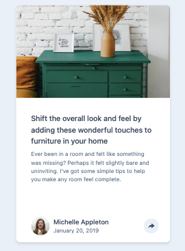

# Frontend Mentor - Article preview component solution

This is a solution to the [Article preview component challenge on Frontend Mentor](https://www.frontendmentor.io/challenges/article-preview-component-dYBN_pYFT).

## Table of contents

- [Overview](#overview)
  - [The challenge](#the-challenge)
  - [Screenshot](#screenshot)
- [My process](#my-process)
  - [Built with](#built-with)
  - [What I learned](#what-i-learned)
  - [Continued development](#continued-development)

## Overview

### The challenge

Users should be able to:

- View the optimal layout for the component depending on their device's screen size
- See the social media share links when they click the share icon

### Screenshot




## My process

### Built with

- Flexbox
- [React](https://reactjs.org/) - JS library

### What I learned : React custom hooks

```js
import { useState } from "react";
const useToggle = (initialState) => {
  const [show, setShow] = useState(initialState);
  const toggle = () => setShow(!show);
  return [show, toggle];
};
export default useToggle;
```

```js
const [isToggled, setToggle] = useToggle(false);
{
  isToggled && <Icons />;
}
<span className='share__icon' onClick={setToggle}>
  <i className='ri-share-forward-fill'></i>
</span>;
```

### Continued development : CSS for icons after click.
